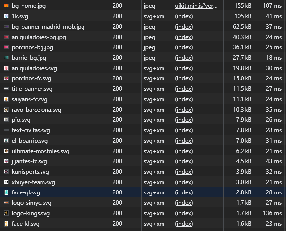
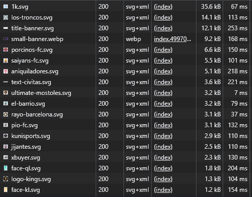

# 👋 Introduction

The purpose of this application is to analyze and address issues on the [Kings League](https://kingsleague.pro/) page using various techniques.

## Image Size

It is worth noticing that image size can have a huge impact on page performance. Optimizing the images is important to avoid long page load times.

On the official website, some images are larger than 100KB. While this is not necessarily a bad thing, in this case, these images can be optimized to significantly reduce their size.

The approach I took to reduce the load size of images is to use tools like [squoosh.app](https://squoosh.app/editor), [Cloudinary](https://cloudinary.com/), and [SvgOMG](https://jakearchibald.github.io/svgomg/).

For images **(.jpg)** that are loaded and exceed 70KB in size, I converted them into **.webp** format.

On the other hand, I reduced the size of all the **.svg** by using [SvgOMG](https://jakearchibald.github.io/svgomg/).

The above section loads **320 KB** of images. With proper optimization, it can be reduced to less than **120KB**, which is an incredible performance improvement.

  
Before

  

  
After

  

### Serve WebP images

Even though WebP is a modern image format that provides superior lossless and lossy compression for web images, it is not supported by older browsers.

If your application needs to support older browsers, I encourage you to look at the following post: [Serve WebP images - web.dev](https://web.dev/serve-images-webp/#serve-webp-images)

## Web Font

When you measure the page load with Lighthouse or the performance DevTools, the text is invisible until the font is loaded.

This problem can be solved by using the CSS descriptor `font-display: swap` inside the `@font-face` declaration. The `font-display: swap` descriptor means that the browser draws text immediately with a fallback if the font face isn’t loaded, but swaps the font face in as soon as it loads.

### Preload WebFont resources

In the above audit, the web fonts are part of the critical request chain and fetched last. However, considering the importance of the fonts on the Kings League page, by preloading them, the browser knows that it needs to download the font earlier, without having to wait for the CSSOM to be created.

## Defer non-critical CSS

CSS files are render-blocking resources, as they need to be loaded and processed before the browser renders the page.

When analyzing the page with the coverage DevTools, it becomes clear that the page is being blocked by non-critical CSS. To reduce the blocking time and improve page load time, there are a few common approaches:

1. Defer non-critical CSS
2. Minify CSS
